# angle
jquery.angle.js - `jQuery` plugin

------

#### 使用说明
##### 引入必要的文件，当然还需要 `jQuery` 库
```javascript
<link type="text/css" rel="stylesheet" href="angle.css" />
<script type="text/javascript" src="jquery.angle.js"></script>
```

##### 参数列表
|      参数名     |       类型       |         默认值         |     说明     |
| -------------- | ---------------- | --------------------- | ------------ |
| speed          |     integer      |     2                 | 变换速度，越大越快 |
| drag           |     boolean      |     false             | 是否支持拖拽 |
| previous       |     selector     |                       | 点击展示上一个 |
| next           |     selector     |                       | 点击展示下一个 |
| current        |     integer      |     0                 | 当前项 |
| get_items      |     function     |     function() {}     | 动态加载 items |
| after          |     function     |     function() {}     | 每次变换后执行的函数 |

##### 举例说明
```html
<div class="angle-view" id="angle-view">
    <ul>
        <li>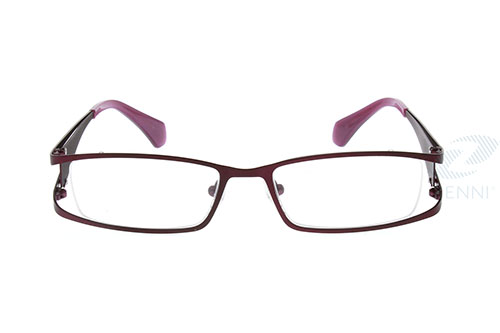</li>
        <li>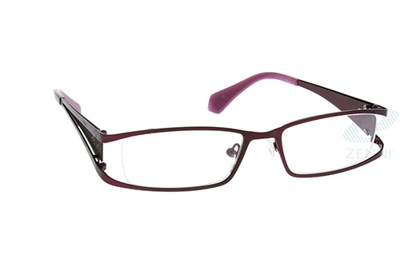</li>
        <li>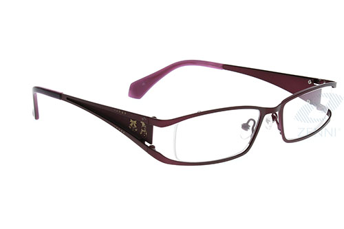</li>
        <li>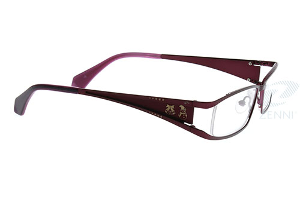</li>
        <li>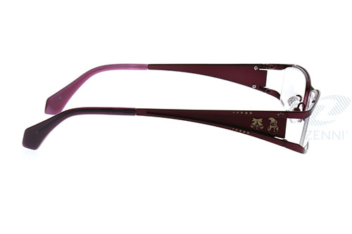</li>
        <li>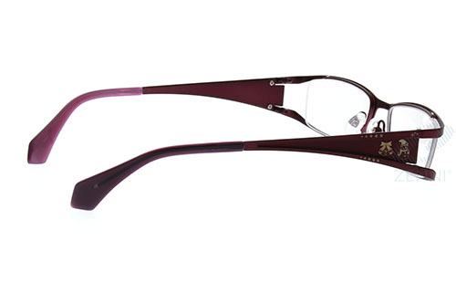</li>
        <li>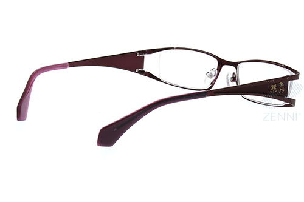</li>
        <li>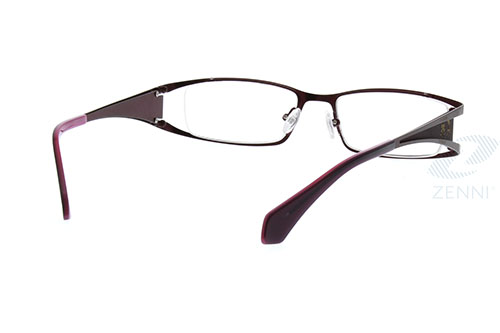</li>
        <li>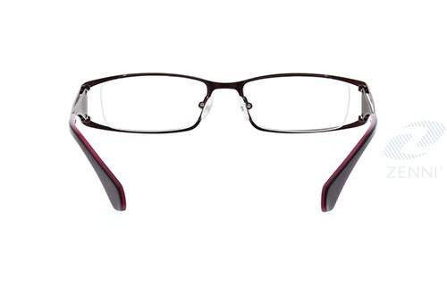</li>
        <li>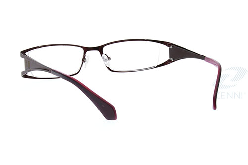</li>
        <li>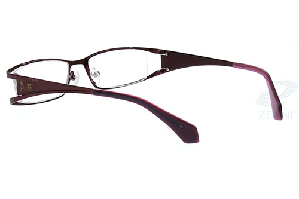</li>
        <li>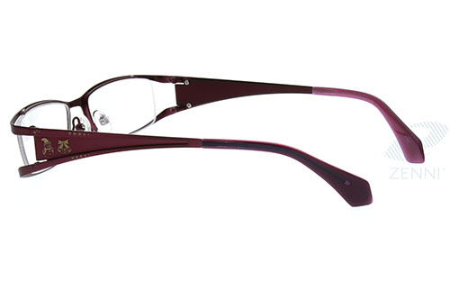</li>
        <li>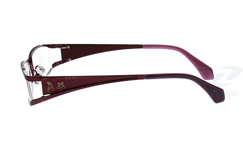</li>
        <li>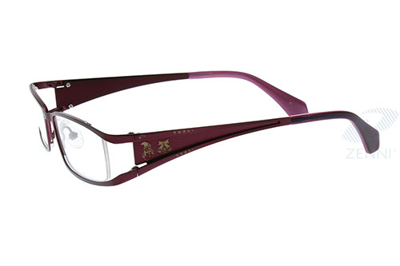</li>
        <li>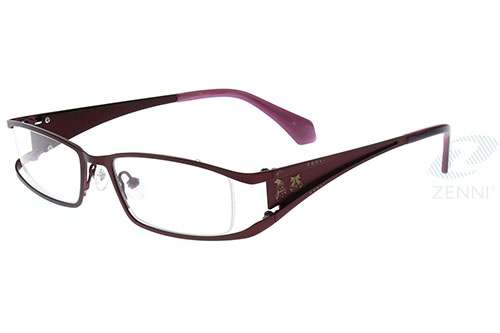</li>
        <li>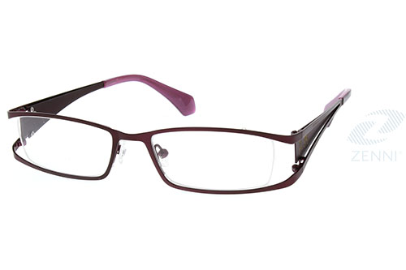</li>
    </ul>
</div>
```

```javascript
$('#angle-view').angle({
    speed: 1,
    drag: true,
	previous: '.prev',
	next: '.next',
	current: 2,
	after: function() {
		console.log('after');
	}
});
```
更多实例请参考 example.html

------

#### 变更记录
##### 2014.09.03 Version v1.3
 * Fix angle view in popup

##### 2014.01.03 Version v1.1
 * Add speed options
 * Remove width & height options, just get from CSS
 * In the container, touch event can vertical scrolling
 * Add drag options used by mouse
